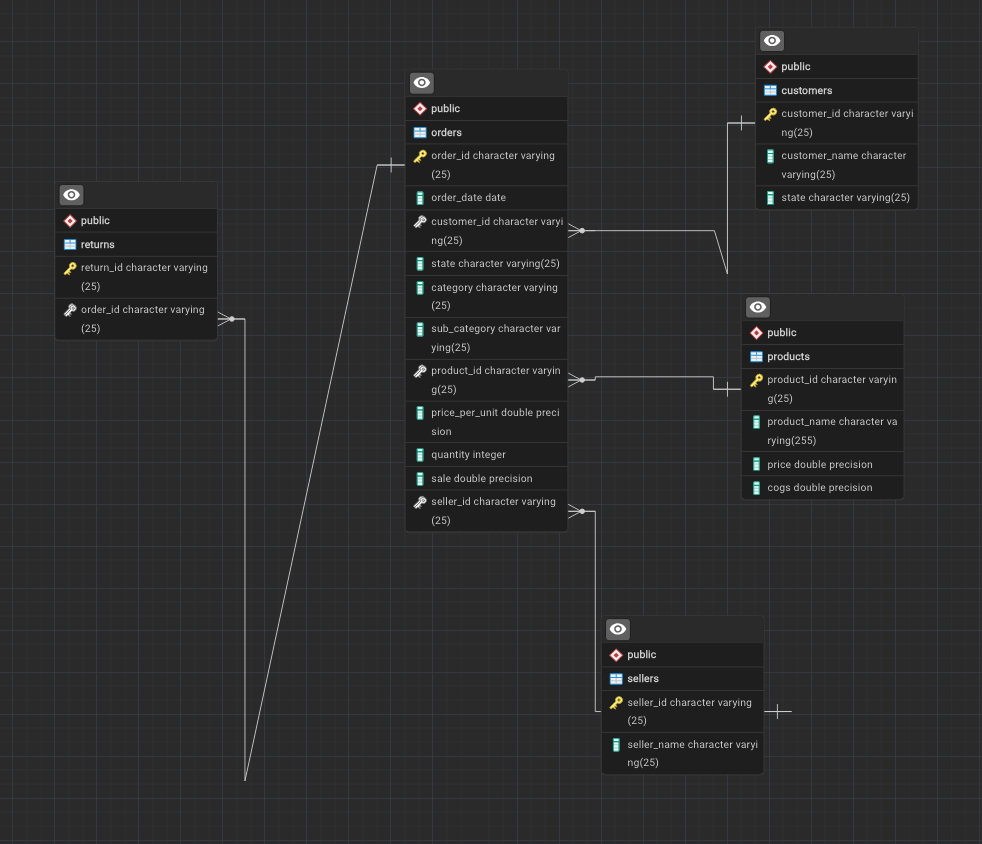

# Amazon-Sales-Analysis-Project


Welcome to the Amazon Sales Analysis project! In this project, we delve into analyzing sales data from Amazon to extract insights and trends that can help optimize sales strategies, understand customer behavior, and improve business operations.

## Introduction

This project focuses on analyzing a dataset containing Amazon sales records, including
information such as sales dates, customer details, product categories, and revenue figures. By
leveraging SQL queries and data analysis techniques, we aim to answer various questions and
uncover valuable insights from the dataset.

## Dataset Overview

The dataset used in this project consists of 9989 rows of data, representing Amazon
sales transactions. Along with the sales data, the dataset includes information about customers,
products, orders, and returns. Before analysis, the dataset underwent preprocessing to handle
missing values and ensure data quality.

## Analysis Questions Resolved

During the analysis, the following key questions were addressed using SQL queries and data
analysis techniques:

## Analysis Questions Resolved
During the analysis, the following key questions were addressed using SQL queries and data
analysis techniques:

1. Find out the top 5 customers who made the highest profits.
```sql
select order_id,
		customer_id,
		customer_name,
		tot_Sale ,
	    tot_Sale- cogs_actual as profit
from 
(select o.order_id,
		o.customer_id,
		c.customer_name,
		sum(sale) as tot_Sale,
		p.cogs * o.quantity as cogs_actual
from orders as o
inner join customers as c
on o.customer_id = c.customer_id
inner join products as p
on o.product_id = p.product_id
group by 1,2,3,5) as t1
order by profit desc
limit 5
```

2. Find out the average quantity ordered per category.
```sql
select 
		category,
		count(order_id) as cat_cnt,
		avg(quantity) as avg_qty_odr
from orders
where  category is not null
group by 1
order by 2 desc,3 desc

```
3. Identify the top 5 products that have generated the highest revenue.
```sql
select o.product_id,
       p.product_name,
	   sum(o.sale) as tot_rev
from orders as o
inner join products as p
on o.product_id = p.product_id
group by 1,2
order by 3 desc
limit 5

```

4. Determine the top 5 products whose revenue has decreased compared to the previous year.
```sql
WITH product_revenue AS (
    SELECT 
        o.product_id,
        p.product_name,
        EXTRACT(YEAR FROM o.order_date) AS year,
        SUM(o.sale) AS revenue
    FROM 
        orders o
    JOIN 
        products p ON o.product_id = p.product_id
    GROUP BY 
        o.product_id, p.product_name, EXTRACT(YEAR FROM o.order_date)
		
),
revenue_change AS (
    SELECT 
        product_id,
        product_name,
        year,
        revenue,
        LAG(revenue) OVER (PARTITION BY product_id ORDER BY year) AS prev_year_revenue,
        revenue - LAG(revenue) OVER (PARTITION BY product_id ORDER BY year) AS revenue_change
    FROM 
        product_revenue
    WHERE 
        year = EXTRACT(YEAR FROM CURRENT_DATE) - 1  -- Compare with the previous year
),
row_num_Rnk as 
(
	SELECT 
    	product_id,
    	product_name,
    	year,
    	revenue,
    	prev_year_revenue,
    	revenue_change,
		ROW_NUMBER() OVER (ORDER BY revenue - revenue_change) as rnks
FROM 
    revenue_change
)
SELECT 
    	product_id,
    	product_name,
    	year,
    	revenue,
    	prev_year_revenue,
    	revenue_change,rnks
from row_num_Rnk		
WHERE 
    rnks <= 5 AND revenue_change < 0
ORDER BY 
    revenue_change;

```

5. Identify the highest profitable sub-category.
```sql
select sub_category,
       (tot_rev-tot_cog) as sub_cat_profit
from  
         (select  
		            o.sub_category,
		            sum(o.sale) as tot_rev,
		            sum(p.cogs*o.quantity) as tot_cog
                from orders as o
                left join products as p 
                on o.product_id = p.product_id
                group by 1
          ) as t1
order by 2 desc
limit 5

```

6. Find out the states with the highest total orders.
```sql
select 
      cx.state,
	  count(o.order_id) as odr_qty,
	  sum(o.sale) as tot_Rev
from orders as o
join customers as cx
on o.customer_id = cx.customer_id
group by 1
order by 2 desc
limit 1

```

7. Determine the month with the highest number of orders.
```sql
select 
       to_char ( order_date ,'month') as mnts,
	   extract(month from order_date ) as mnt_num,
       count(*) as odr_qty 
from orders 
group by 1,2
order by 3 desc

```

8. Calculate the profit margin percentage for each sale (Profit divided by Sales).
```sql
select order_id,
       (sale-org_cogs)* 100 /sale::numeric  as profit_margin_percet
from 
(select order_id,
      sale,
	  p.cogs*o.quantity as org_cogs
	  
from orders as o
join products as p 
on o.product_id = p.product_id) as t1

```

9. Calculate the percentage contribution of each sub-category.
```sql
with cte1 
as 
(
   select 
          sum(sale) as overall_rev
   from orders
)
select sub_category,
       sum(sale) as cat_rev,
	   sum(sale)/(select overall_rev from cte1) *100 as percent_contri
from orders
group by 1
order by 3 desc


```

10. Identify the top 2 categories that have received maximum returns and their return
percentage.
```sql

```

## Entity-Relationship Diagram (ERD)


An Entity-Relationship Diagram (ERD) has been created to visualize the relationships between
the tables in the dataset. This diagram provides a clear understanding of the data structure and
helps in identifying key entities and their attributes.

## Getting Started
To replicate the analysis or explore the dataset further, follow these steps:

1. Clone the repository to your local machine.
2. Ensure you have a SQL environment set up to execute queries.
3. Load the provided dataset into your SQL database.
4. Execute the SQL queries provided in the repository to analyze the data and derive insights.
5. Customize the analysis or queries as needed for your specific objectives.

## Conclusion

Through this project, we aim to provide valuable insights into Amazon sales trends, customer
preferences, and other factors influencing e-commerce operations. By analyzing the dataset
and addressing the key questions, we hope to assist stakeholders in making informed decisions
and optimizing their sales strategies.

Feel free to explore the repository and contribute to further analysis or enhancements!

## Notice:
All customer names and data used in this project are computer-generated using AI and random
functions. They do not represent real data associated with Amazon or any other entity. This
project is solely for learning and educational purposes, and any resemblance to actual persons,
businesses, or events is purely coincidental.
